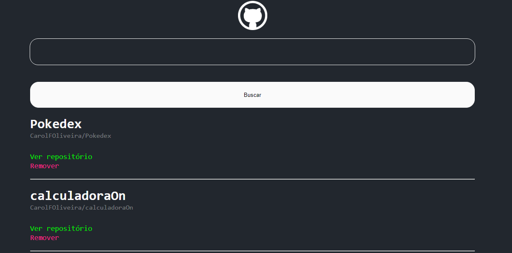

#   Wiki

Wiki para salvar alguns repositórios do GitHub. Fazendo o consumo da API do GitHub para buscar e listar os repositórios.

## :arrow_right_hook: Ações

-   Buscar e listar repositórios
-   Ver repositório no GitHub
-   Remover

## :computer:  Tecnologias usadas:

-   `React`
-   `Html`
-   `Css`
-   `Javascript`

##  :tv:  Tela

